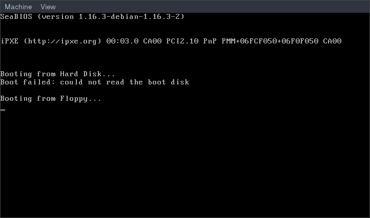

# Boot mínimo

Este seria o código mínimo, em assembly para ocupar os 512 bytes do setor de
boot de uma imagem de inicialização:

```asm
org 0x7c00
bits 16

jmp $

times 510-($-$$) db 0
dw 0xaa55
```

Essencialmente, este programa apenas fornece algo para o BIOS encontrar e
carregar na memória.

## Montagem

```
$ nasm boot-min.asm -f bin -o teste.bin
```

O conteúdo do binário será:

```
$ xxd teste.bin
00000000: ebfe 0000 0000 0000 0000 0000 0000 0000  ................
00000010: 0000 0000 0000 0000 0000 0000 0000 0000  ................
00000020: 0000 0000 0000 0000 0000 0000 0000 0000  ................
...
000001d0: 0000 0000 0000 0000 0000 0000 0000 0000  ................
000001e0: 0000 0000 0000 0000 0000 0000 0000 0000  ................
000001f0: 0000 0000 0000 0000 0000 0000 0000 55aa  ..............U.
```

## Testando no QEMU

```
$ cp teste.bin teste.img
$ truncate -s 1440k teste.img
$ qemu-system-i386 -drive file=teste.img,format=raw,index=0,if=floppy
```

Resultando em...




